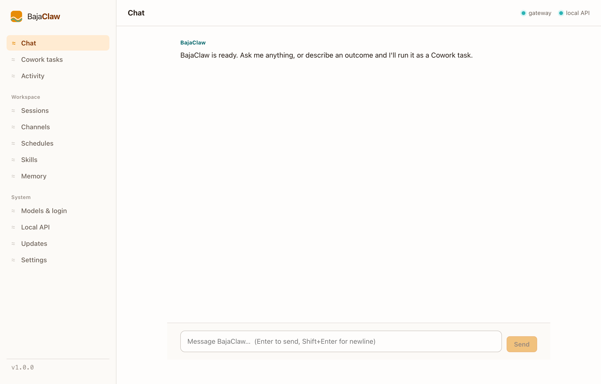

<div align="center">

# BajaClaw

**A standalone, all-in-one personal AI agent.**

Sign in with ChatGPT, chat from a clean web UI or your favorite messaging app,
and expose it to your other programs as a local OpenAI-compatible API. One
command starts everything.

```
  ┌╶╶╶╮
  ╿ BAJACLAW  ≈≈≈
  the all-in-one personal agent
```

</div>

---

BajaClaw is inspired by [OpenClaw](https://github.com/openclaw/openclaw),
[Hermes](https://github.com/NousResearch/hermes-agent), and Claude Cowork, but
depends on none of them. It is a single, self-contained tool you run on your own
machine.

- **Sign in with ChatGPT** as the default model (your own subscription, via PKCE
  OAuth). Every other provider is available too, with automatic fallback.
- **Clean web control room** to chat, watch activity, and manage everything.
- **Native messaging channels** so you can reach your agent from Telegram or
  Discord.
- **Local OpenAI-compatible endpoint** so any OpenAI client can use BajaClaw as a
  local LLM.
- **Self-improving memory** that recalls relevant past outcomes.
- **Cowork outcome mode**: describe a goal, get a finished deliverable.
- **One-command start** with a launchd daemon, so it comes back after a reboot.



## Install

Requires Node.js >= 22.19.

```bash
npm install -g bajaclaw
bajaclaw onboard      # sign in with ChatGPT (or pick any other provider)
bajaclaw start        # start the gateway, web UI, local API, and channels
```

That is the whole install. No second package. After a reboot, run
`bajaclaw start` again (on macOS the launchd daemon also restores it on its own).

Open the UI with `bajaclaw ui` (defaults to `http://127.0.0.1:18790`).

## Commands

**Run**

| Command | What it does |
|---|---|
| `bajaclaw onboard` | Guided setup: model, fallbacks, local API, channels, features, daemon. |
| `bajaclaw start` | Start everything (gateway + web UI + local API + channels). |
| `bajaclaw stop` / `restart` | Control the daemon. |
| `bajaclaw status` / `doctor` | Health and environment. |
| `bajaclaw ui` | Open the web interface. |
| `bajaclaw uninstall` | Remove the boot daemon. |

**Talk**

| Command | What it does |
|---|---|
| `bajaclaw ask "…"` | One-shot question, streamed to your terminal. |
| `bajaclaw chat` | Interactive terminal chat. |
| `bajaclaw cowork "…"` | Run a goal end-to-end and print the steps. |

**Manage**

| Command | What it does |
|---|---|
| `bajaclaw providers` | List providers and what is configured. |
| `bajaclaw login <id>` / `logout <id>` | Provider auth (ChatGPT OAuth or API key). |
| `bajaclaw channels [enable\|disable\|token] <id>` | Messaging channels. |
| `bajaclaw memory [query\|clear]` | Browse, search, or clear memory. |
| `bajaclaw skills` | Learned skills. |
| `bajaclaw update` | Check upstreams and write an approve-to-merge proposal. |
| `bajaclaw config [get\|set]` | View or change settings. |
| `bajaclaw logs` | Tail the daemon logs. |

The web dashboard mirrors most of this: set your default model and keys, enable
channels, search memory, run Cowork goals, toggle features, and watch live
activity.

## Models

ChatGPT (via your subscription) is the default, signed in with a native PKCE
OAuth flow. Every other provider stays available, with automatic fallback if one
is rate-limited:

| Provider | Auth |
|---|---|
| **ChatGPT** (default) | Sign in with your subscription |
| Anthropic / Claude | API key |
| Google Gemini | API key |
| OpenAI API | API key |
| OpenRouter | API key (200+ models) |
| Groq | API key |
| DeepSeek | API key |
| Ollama | Local, no key |
| LM Studio | Local, no key |

You log in with **your own** account. Nothing is pooled, shared, or resold.

## Local OpenAI endpoint

Point any OpenAI client at BajaClaw to use it as a local LLM. Every request runs
through BajaClaw's agent and your configured provider.

```
Base URL: http://127.0.0.1:11435/v1
Models:   bajaclaw, bajaclaw-chatgpt, bajaclaw-fast, bajaclaw-raw
```

```bash
curl http://127.0.0.1:11435/v1/chat/completions \
  -H "content-type: application/json" \
  -d '{"model":"bajaclaw","messages":[{"role":"user","content":"hello"}]}'
```

It binds to localhost only by default. Port 11435 leaves 11434 free for Ollama.

### Bare mode

By default the endpoint runs the agent: it adds a system prompt, recalls relevant
memory, and logs the outcome. For a plain model passthrough with none of that (no
system prompt, no memory, no logging, no tools), use the **`bajaclaw-raw`** model:

```bash
curl http://127.0.0.1:11435/v1/chat/completions \
  -d '{"model":"bajaclaw-raw","messages":[{"role":"user","content":"hello"}]}'
```

To make the whole endpoint bare by default, set `openaiEndpoint.mode` to `"raw"`
in `~/.bajaclaw/config.json`. Either way it still picks your configured provider
and falls back between providers; "bare" only strips the agent extras.

## Channels

Reach BajaClaw where you already chat. Enable a channel and add its token in
onboarding or in `~/.bajaclaw/config.json`, then `bajaclaw restart`.

| Channel | Status |
|---|---|
| Telegram | Native, working (bot token from @BotFather) |
| Discord | Native, working (bot token) |
| Slack / WhatsApp / iMessage | Scaffolded with a clear native path |

See [docs/CHANNELS.md](docs/CHANNELS.md).

## Documentation

- [Architecture](docs/ARCHITECTURE.md) - how the pieces fit together.
- [Configuration](docs/CONFIGURATION.md) - config file, ports, providers, channels.
- [Channels](docs/CHANNELS.md) - setting up each messaging channel.
- [Design](docs/DESIGN.md) - the visual and product design rationale.
- [Contributing](CONTRIBUTING.md) - local development and pull requests.
- [Changelog](CHANGELOG.md).

## A note on the ChatGPT backend

"Sign in with ChatGPT" uses the same subscription mechanism the Codex CLI uses.
It is reverse-engineered and has no SLA, so it can change without notice. If it
ever breaks, any other provider works as a drop-in via fallback. Use your own
account only; do not pool or resell access.

## License

[MIT](LICENSE)
